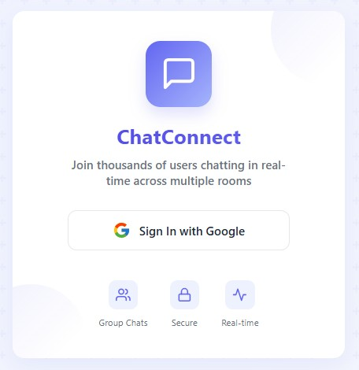
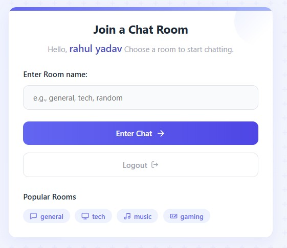

# ChatApp

This repository contains a simple chat application built using React and Firebase(Authentication and Database).

## Overview

This project implements a basic real-time chat application. Users can send and receive messages, providing a simple communication platform. The backend is handled by Firebase, offering real-time database capabilities, and user authentication.

**Note:** This project is primarily a demonstration and learning exercise. It is **not intended for direct production use** without significant modifications and security enhancements.

## Features

* **Real-time Messaging:** Messages are updated in real-time using Firebase's Realtime Database.
* **User Authentication:** Users can sign up and log in using Firebase Authentication.
* **Simple UI:** A clean and straightforward user interface for easy communication.

## Technologies Used

* **React:** For building the user interface.
* **Firebase:** For backend services (Realtime Database and Authentication).
* **JavaScript (ES6+):** For the application logic.
* **CSS:** For styling.

## Setup

1.  **Clone the repository:**

    ```bash
    git clone [https://github.com/SahilB2k/ChatApp.git](https://www.google.com/search?q=https://github.com/SahilB2k/ChatApp.git)
    cd ChatApp
    ```

2.  **Install dependencies:**

    ```bash
    npm install
    ```

3.  **Configure Firebase:**
    * Create a Firebase project on the Firebase console.
    * Enable Email/Password authentication.
    * Create a Realtime Database.
    * Copy your Firebase configuration and replace the placeholder in `src/firebase.js`.

    ```javascript
    // src/firebase.js
    const firebaseConfig = {
      apiKey: "YOUR_API_KEY",
      authDomain: "YOUR_AUTH_DOMAIN",
      databaseURL: "YOUR_DATABASE_URL",
      projectId: "YOUR_PROJECT_ID",
      storageBucket: "YOUR_STORAGE_BUCKET",
      messagingSenderId: "YOUR_MESSAGING_SENDER_ID",
      appId: "YOUR_APP_ID"
    };
    ```

4.  **Run the application:**

    ```bash
    npm start
    ```

    The application will be accessible at `http://localhost:3000`.

## Important Notes

* **UI Generation:** The user interface for this application was primarily generated using AI tools such as ChatGPT v0 and Claude. This means that while functional, the UI may not adhere to best practices or be optimized for performance and accessibility.
* **Production Readiness:** This project is a basic demonstration. It lacks essential features required for production environments, including:
    * Robust error handling.
    * Input validation and sanitization.
    * Scalability considerations.
    * Comprehensive security measures.
    * Advanced UI/UX improvements.
* **Security:** The current implementation may have security vulnerabilities. Ensure thorough security testing and implement appropriate measures before deploying this application in a production setting.
* **Future Improvements:** Future improvements could include:
    * Adding private messaging.
    * Implementing message editing and deletion.
    * Improving the UI/UX for better user experience.
    * Adding image and file sharing capabilities.
    * Adding Online/Offline user status.

## Contributing

Contributions are welcome! Please feel free to submit pull requests or open issues for any improvements or bug fixes.




